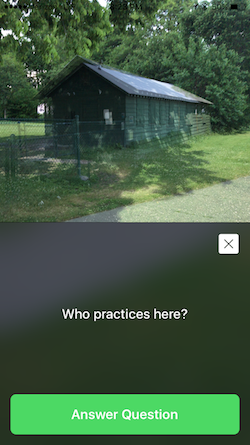

# Quest

Quest (or NavQuest as the running project is called) is a GPS and Camera-based scavenger hunt game. It uses the device heading, gps sensors, and the camera to give the player clues as they work to complete the current objective (and their current quest).

Once a quest has been started, there are 3 modes:

1. **Map** -- The target within a given radius is shown and the user must figure out how to get there.
2. **Compass** -- The destination is not shown, and the user is simply pointed in the correct direction of travel.
3. **Camera** -- The live camera feed is shown with or without the help of an overlay.

All 3 modes support questions. These questions can be triggered by location or displayed to the user immediately. To progress the user will have to answer the question correctly. Currently only multiple choise and free response questions are supported.

# Sample Screenshots

**Live camera feed with overlay photo of same real-world thing** with items photoshopped out.

* Boathouse: The windows were removed
* Archery Club Building: the background was removed
* Marina signal light: the entire tower was removed from the overlay





**Camera and Map modes:** Questions would appear as shown above should they be triggered when the destination was reached.


# Data Format

All quests are stored in *.json files. They require the following format:

```
{
  name: <string name presented to users when beginning quest>,
  sku: <unique internal identifier>,
  start: {
    lat: <float>,
    long: <float>,
    radius: <float>
  },
  steps: [Quest Step]
}
```

Step Schema:

```
{
  type: <compass || map || camera>,
  overlay: <photo identifier>,
  destination: { 
    lat: <float>,
    long: <float>,
    radius: <float>,
    autocomplete: <bool>
  },
  question: {
    question: <text question>,
    answer: <string answers>,
    options: [<string option>]
  }
}
```

Details:

* Compass and map require `destination`. Camera does not.
* `options` is an optional question key. When included the question will be multiple choice instead of short answer.
* `autocomplete` will advance to the next step when the destination is reached (if there is no question). Otherwise the user will have to manually click 'continue' to advance after arriving. This is useful for long, winding navigation with the compass.
* The `overlay` key is only used in camera mode. If absent or invalid no overlay will be shown.

# Additional Details

This project was developed for my fiancée, hence the non-standard questions in `lake_adventure`.

# License

This project is completely open source and under the MIT license. For full details please see [license.md](LICENSE.md)